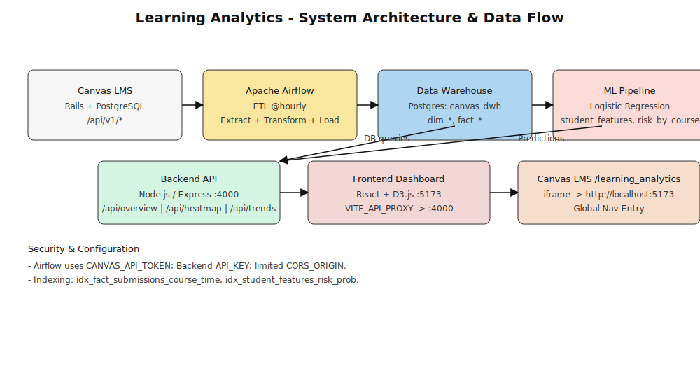

<!-- Prefer SVG; some viewers block it. Try both syntaxes -->

  

Xem trực tiếp: images/system_overview.svg

graph TD
    A[Canvas LMS (Rails + PostgreSQL)] 
        -->|Canvas API| B[Airflow ETL (Extract @hourly)]
    B -->|Transform + Load| C[Postgres DWH (canvas_dwh)]
    C -->|Feature Engineering| D[ML Pipeline (train_ml Task)]
    D -->|Predictions| E[Backend API (Node.js / Express :4000)]
    E -->|REST / JSON| F[Frontend Dashboard (React + D3.js :5173)]
    F -->|iframe Embed| G[Canvas LMS /learning_analytics Page]

    subgraph Data Flow
        A --> B --> C --> D --> E --> F --> G
    end

    style A fill:#f6f6f6,stroke:#333,stroke-width:1px
    style B fill:#f9e79f,stroke:#333,stroke-width:1px
    style C fill:#aed6f1,stroke:#333,stroke-width:1px
    style D fill:#fadbd8,stroke:#333,stroke-width:1px
    style E fill:#d5f5e3,stroke:#333,stroke-width:1px
    style F fill:#f2d7d5,stroke:#333,stroke-width:1px
    style G fill:#f6ddcc,stroke:#333,stroke-width:1px

