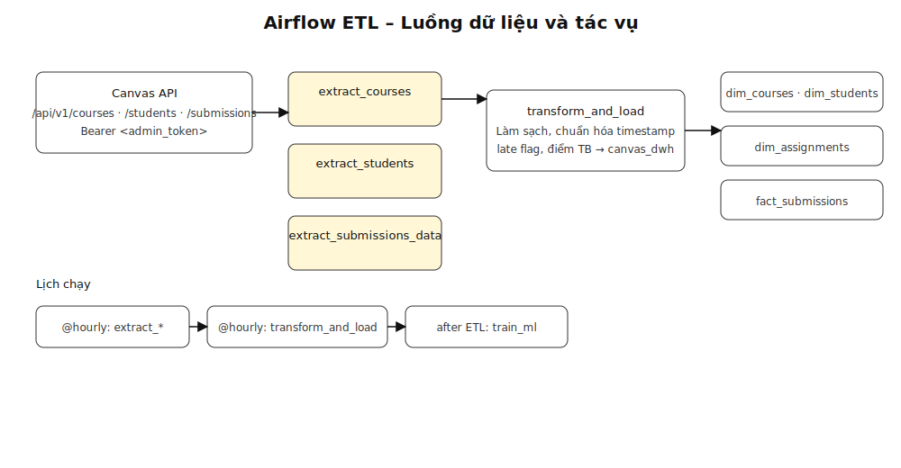
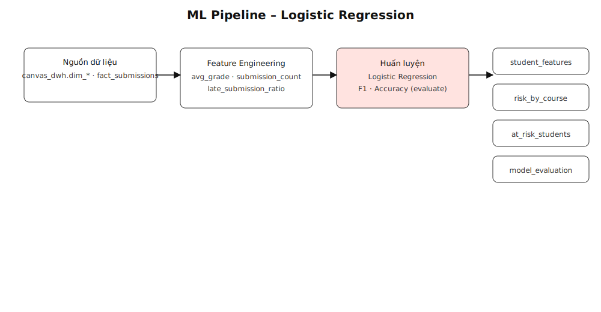
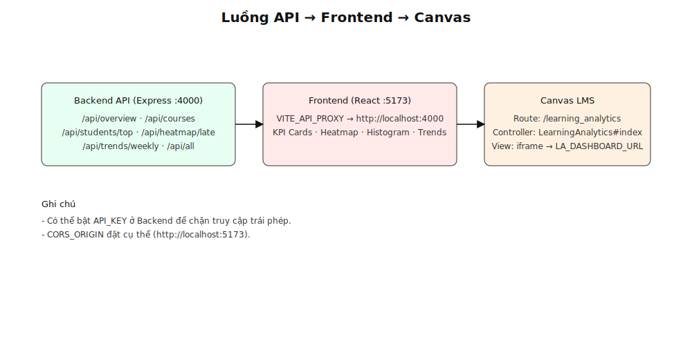
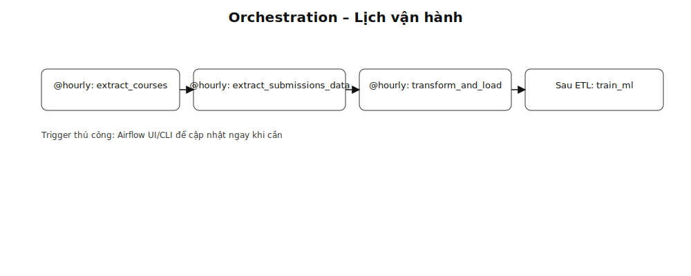
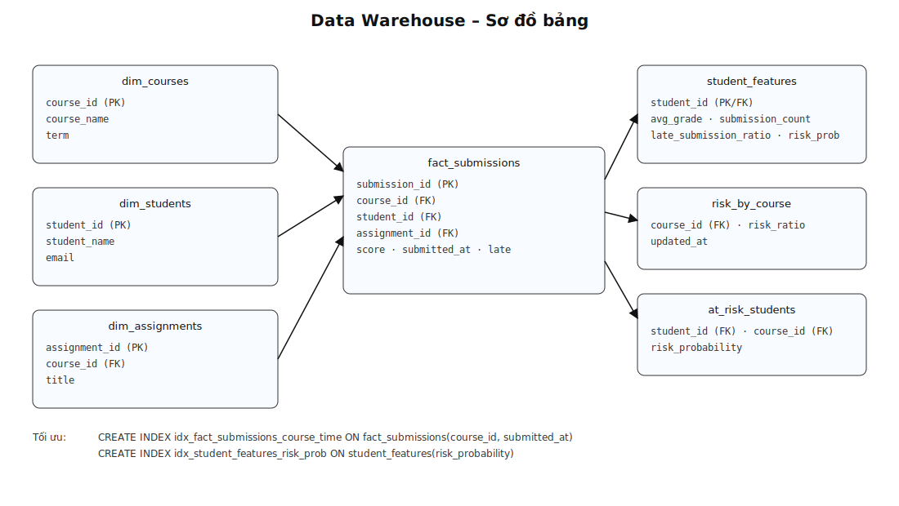

# Hệ thống Learning Analytics – Sơ đồ luồng

Tập hợp các hình SVG mô tả kiến trúc và luồng hoạt động, bám sát mô tả tổng quan hệ thống.

- Tổng thể: `learning_analytics/docs/images/system_overview.svg`
- ETL/DAG: `learning_analytics/docs/images/etl_pipeline.svg`
- ML Pipeline: `learning_analytics/docs/images/ml_pipeline.svg`
- Backend → Frontend → Canvas: `learning_analytics/docs/images/backend_frontend_canvas.svg`
- Lịch vận hành: `learning_analytics/docs/images/orchestration_schedule.svg`
- Sơ đồ DWH: `learning_analytics/docs/images/dwh_schema.svg`

Gợi ý nhúng trong Markdown:

```md






```

